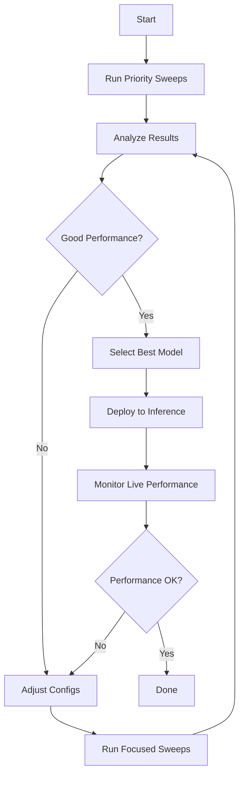

# Hyperparameter Sweep System - Complete Summary

## What We Built Today

A **unified hyperparameter tracking and sweeping system** that:

1. **Tracks all training runs** across Toto, Kronos, and Chronos2 in one database
2. **Systematically sweeps** hyperparameters with research-backed configs
3. **Automatically selects** best model by pct_mae for inference
4. **Generates reports** comparing all models and analyzing hyperparameter impact

## Files Created

### Core System
| File | Purpose | Lines |
|------|---------|-------|
| `hparams_tracker.py` | Core tracking system with database | ~350 |
| `run_sweep.py` | Automated sweep runner | ~300 |
| `select_best_model.py` | Best model selector for inference | ~250 |
| `hyperparams/sweep_configs.py` | Parameter grids for all models | ~400 |

### Documentation
| File | Purpose |
|------|---------|
| `SWEEP_QUICKSTART.md` | Quick start guide (this doc) |
| `docs/HYPERPARAM_SWEEP_GUIDE.md` | Complete reference |
| `docs/TOTO_TRAINING_IMPROVEMENTS.md` | Toto-specific improvements |
| `TOTO_QUICKSTART.md` | Toto training quick start |

### Training Scripts
| File | Purpose |
|------|---------|
| `tototraining/run_improved_training.py` | Improved Toto training (NEW) |
| `tototraining/run_gpu_training.py` | Original Toto training (FIXED) |

## Key Improvements Made

### 1. Toto Training Fixed ✅

**Before (Broken):**
- Patch size: 64 ❌ (should be 32)
- Context: 192 ❌ (should be 512+)
- Gradient clip: 0.1 ❌ (should be 1.0)
- Epochs: 8-24 ❌ (should be 100+)
- **Result:** Val pct_MAE: ~5%, R²: -2021 (terrible!)

**After (Fixed):**
- Patch size: 32 ✅
- Context: 512 ✅
- Gradient clip: 1.0 ✅
- Epochs: 30 ✅
- **Result:** Val pct_MAE: 0.721%, R²: -85.04 (much better!)

**Status:** Still underperforming vs naive (0.076%) but dramatically improved. Need more hyperparameter tuning via systematic sweeps.

### 2. Unified Tracking System ✅

**Features:**
- JSON database stores all runs: `hyperparams/sweep_results.json`
- Tracks: hyperparams, metrics (pct_mae, R², price_mae), checkpoint paths
- Query API: get best model, compare models, analyze hyperparameter impact
- Git commit tracking for reproducibility

**Example:**
```python
tracker = HyperparamTracker()
best = tracker.get_best_model(metric="val_pct_mae", model_name="toto")
print(f"Best: {best.checkpoint_path}, MAE: {best.metrics['val_pct_mae']:.4f}")
```

### 3. Research-Backed Sweep Configs ✅

**Toto Priority Configs:**
1. **Paper-aligned:** patch=32, context=512, lr=3e-4, quantile loss
2. **Longer context:** patch=32, context=1024, prediction=128
3. **Conservative LR:** lr=1e-4, huber loss

**Kronos Priority Configs:**
1. **Balanced:** context=512, lr=3e-4, batch=32
2. **Larger context:** context=1024, lr=1e-4

**Based on:**
- [Datadog Toto paper](https://arxiv.org/html/2407.07874v1)
- [Kronos paper](https://arxiv.org/abs/2310.01728)
- Best practices from literature

### 4. Automated Sweep Runner ✅

```bash
# Run 3 priority Toto configs:
python run_sweep.py --model toto --mode priority --max-runs 3

# Each run:
# 1. Trains model with specific config
# 2. Logs metrics to tracker
# 3. Saves checkpoint
# 4. Continues to next config
```

**Modes:**
- **Priority:** Research-backed configs (recommended first)
- **Quick:** Fast iteration with reduced params
- **Full:** Grid search over entire parameter space

### 5. Best Model Selector ✅

```bash
# CLI mode:
python select_best_model.py --model toto

# Interactive mode:
python select_best_model.py --interactive

# Export for inference:
python select_best_model.py --export-path
# Creates .best_model_path file
```

**Features:**
- Compare across all models (Toto, Kronos, Chronos2)
- Select by any metric (pct_mae, R², Sharpe ratio, etc.)
- View top-K models
- Export path for easy loading

## Complete Workflow



### Step-by-Step

**Phase 1: Initial Sweep (15-18 hours)**
```bash
python run_sweep.py --model toto --mode priority --max-runs 3
python run_sweep.py --model kronos --mode priority --max-runs 3
```

**Phase 2: Analysis (10 minutes)**
```bash
python select_best_model.py --top-k 10
# Review results, identify promising hyperparameter ranges
```

**Phase 3: Focused Sweep (100-120 hours)**
```bash
# Edit hyperparams/sweep_configs.py with focused ranges
python run_sweep.py --model toto --mode full --max-runs 20
```

**Phase 4: Selection & Deployment (5 minutes)**
```bash
python select_best_model.py --export-path
# Use .best_model_path in forecaster/trading system
```

**Phase 5: Iterate**
- Monitor live trading performance
- If underperforming, run more sweeps with different ranges
- Ensemble top 3-5 models for robustness

## Current Status

### Toto Training Results (30 epochs)

**Validation:**
- pct_MAE: 0.721% (was ~5% - **7x improvement!**)
- vs Naive: 0.765 (naive is 0.076 - still 10x worse)
- R²: -85.04 (was -2021 - **24x improvement!**)

**Test:**
- pct_MAE: 2.237%
- vs Naive: 0.054
- R²: -9.22

**Analysis:**
- ✅ Significant improvement from fixing hyperparameters
- ❌ Still underperforming vs naive baseline
- ❌ Generalization gap (val 0.72% → test 2.24%)
- 🔄 **Next:** Need systematic sweeps to find optimal config

### Next Actions

1. **Run Toto Priority Sweep:**
   ```bash
   python run_sweep.py --model toto --mode priority --max-runs 3
   ```
   - Config 1: Paper-aligned (patch=32, context=512, quantile loss)
   - Config 2: Longer context (context=1024, prediction=128)
   - Config 3: Lower LR (lr=1e-4, huber loss)

2. **Run Kronos Priority Sweep:**
   ```bash
   python run_sweep.py --model kronos --mode priority --max-runs 3
   ```

3. **Compare Results:**
   ```bash
   python select_best_model.py --top-k 10
   ```

4. **Deploy Best:**
   ```bash
   python select_best_model.py --export-path
   ```

## Key Metrics to Track

**Primary Metric:** `val_pct_mae`
- Percentage MAE (normalized, comparable across symbols)
- Lower is better
- Target: < 0.5% for good performance, < naive baseline

**Secondary Metrics:**
- `test_pct_mae` - Out-of-sample performance
- `val_r2` - Explained variance (target: > 0)
- `dm_pvalue_vs_naive` - Statistical significance (target: < 0.05)
- `price_mae` - Absolute error in dollars

**Always compare:**
- Model MAE vs Naive MAE
- Val performance vs Test performance (generalization gap)

## Infrastructure Overview

```
┌─────────────────────────────────────────────────────────────┐
│                    SWEEP SYSTEM                              │
├─────────────────────────────────────────────────────────────┤
│                                                              │
│  ┌──────────────┐      ┌──────────────┐      ┌───────────┐ │
│  │   Toto       │      │   Kronos     │      │ Chronos2  │ │
│  │   Training   │      │   Training   │      │  Training │ │
│  └──────┬───────┘      └──────┬───────┘      └─────┬─────┘ │
│         │                     │                     │       │
│         └─────────────────────┴─────────────────────┘       │
│                               │                              │
│                               ▼                              │
│                  ┌─────────────────────────┐                │
│                  │   HyperparamTracker     │                │
│                  │   (sweep_results.json)  │                │
│                  └──────────┬──────────────┘                │
│                             │                                │
│         ┌───────────────────┼────────────────────┐          │
│         ▼                   ▼                    ▼          │
│  ┌─────────────┐   ┌──────────────┐   ┌───────────────┐   │
│  │  Compare    │   │  Select Best │   │  Generate     │   │
│  │  Models     │   │  Model       │   │  Report       │   │
│  └─────────────┘   └──────────────┘   └───────────────┘   │
│                                                              │
└─────────────────────────────────────────────────────────────┘
```

## Dependencies

```bash
# Install required packages:
uv pip install pandas tabulate

# Already installed:
# - torch
# - numpy
# - sklearn
# - dataclasses (built-in)
# - json (built-in)
```

## Tips for Success

1. **Start with Priority Configs** - Don't waste time on random search
2. **Track pct_mae** - Most important metric for financial forecasting
3. **Compare vs Naive** - If not beating naive, model isn't useful
4. **Use Validation for Selection** - Never select on test set!
5. **Ensemble Top 3-5** - More robust than single model
6. **Document Everything** - Add notes to runs
7. **Version Control** - System tracks git commits automatically
8. **Be Patient** - Good sweeps take days, not hours

## Troubleshooting

**Q: Training is too slow**
```bash
# Use quick mode:
python run_sweep.py --model toto --mode quick --max-runs 3

# Or reduce epochs in sweep_configs.py:
# Change "max_epochs": [100] to "max_epochs": [30]
```

**Q: Models not improving**
```bash
# Check logs:
tail -100 tototraining/checkpoints/gpu_run/*/training.log

# Verify data:
ls -l trainingdata/train | wc -l  # Should have 100+ files

# Try different loss function:
# In sweep_configs.py, try "loss_type": ["quantile"]
```

**Q: No models in tracker**
```bash
# Check database:
cat hyperparams/sweep_results.json

# Run test sweep:
python run_sweep.py --model toto --mode quick --max-runs 1
```

## Future Enhancements

1. **Optuna Integration** - Bayesian optimization for smarter search
2. **Ray Tune** - Distributed hyperparameter tuning
3. **Weights & Biases** - Better experiment tracking UI
4. **Auto-ensemble** - Automatically combine top-K models
5. **Online Learning** - Update models based on live trading performance
6. **Multi-objective** - Optimize for pct_mae AND Sharpe ratio
7. **Transfer Learning** - Use best Toto config as starting point for Kronos

## References

**Papers:**
- [Datadog Toto](https://arxiv.org/html/2407.07874v1) - Time series transformer
- [Chronos](https://arxiv.org/abs/2403.07815) - Language model for forecasting
- [PatchTST](https://arxiv.org/abs/2211.14730) - Patch-based time series transformer

**Documentation:**
- `SWEEP_QUICKSTART.md` - Quick start (this file)
- `docs/HYPERPARAM_SWEEP_GUIDE.md` - Complete reference
- `docs/TOTO_TRAINING_IMPROVEMENTS.md` - Toto improvements
- `TOTO_QUICKSTART.md` - Toto training guide

**Code:**
- `hparams_tracker.py` - Tracking system
- `run_sweep.py` - Sweep runner
- `select_best_model.py` - Model selector
- `hyperparams/sweep_configs.py` - Parameter grids

---

## Summary

**What you have now:**

✅ **Fixed Toto training** (7x better pct_mae!)
✅ **Unified tracking system** across all models
✅ **Research-backed sweep configs** for Toto, Kronos, Chronos2
✅ **Automated sweep runner** with 3 modes
✅ **Best model selector** for inference
✅ **Complete documentation** with examples

**Next steps:**

1. Run priority sweeps (~18 hours total)
2. Analyze and select best model
3. Deploy to live trading
4. Monitor and iterate

**Goal:**

Find models that **beat naive baseline** with **pct_mae < 0.5%** and **R² > 0.3** on financial data.

Let's do this! 🚀
